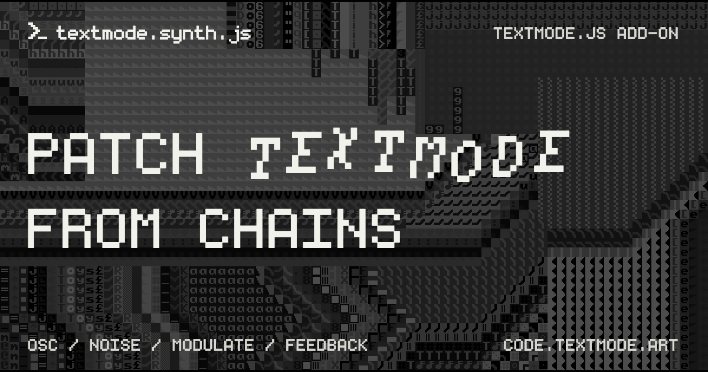

# textmode.synth.js

|    |    |   |
|:---|:---|:---|

`textmode.synth.js` is a modular visual-synthesis add-on for [`textmode.js`](https://github.com/humanbydefinition/textmode.js) for patching together evolving procedural ASCII and textmode animation. Its `hydra`-inspired, chainable API translates composable sources and transforms into optimized GLSL shaders targeting separate character, foreground-color, and background-color textures.

Build a visual system a link at a time: mix oscillators and noise, introduce feedback, or sample layers and media while dynamically modulating parameters. Made for live coding and rapid experimentation, `textmode.synth.js` keeps these expressive generative workflows approachable through concise compositional chains.

## Features

- **Hydra-inspired chains** - Compose procedural sources and transforms through fluent `SynthSource` chains compiled into GLSL
- **Pattern and transform library** - Combine generators, coordinate transforms, color operations, masks, blends, and modulation
- **textmode-native channels** - Control character selection, character color, and cell color independently
- **Dynamic modulation** - Drive parameters with values, contextual callbacks, or BPM-aware arrays with speed, smoothing, easing, offset, and fitting
- **Feedback loops** - Sample previous-frame character, foreground, or background channels through context-aware feedback
- **Layer and media sampling** - Use other textmode layers, images, videos, and textures as synthesis sources
- **Per-layer synthesis** - Apply, replace, clear, and independently pace synth chains on individual layers

## Try it online first

Open [editor.textmode.art](https://editor.textmode.art/), a browser-based live-coding environment for the
complete official `textmode.js` ecosystem. Sketches run as you edit, with no local toolchain required.

The editor includes `textmode.js` and all four official add-ons: `textmode.export.js`, `textmode.filters.js`,
`textmode.figlet.js`, and `textmode.synth.js`.

- Write with Monaco-powered completions, hover documentation, and diagnostics.
- Start with a blank sketch, an included example, or a community gallery sketch.
- Keep code and preferences saved in the browser, then share sketches through URL-based links.
- Use microphone or line-input analysis for audio-reactive work, and create on desktop or mobile.

Use it to build and modify synthesis chains through live coding.

## Installation

Follow the [official installation guide](https://code.textmode.art/docs/installation) to install
`textmode.synth.js` alongside `textmode.js` with npm or browser-ready UMD bundles.

## Next steps

- **[Read the synth documentation](https://code.textmode.art/docs/live-coding-synth-textmode-art)** for synthesis workflows and examples.
- **[Browse the API reference](https://code.textmode.art/api/textmode.synth.js/)** for the complete typed API.
- **[Explore the examples](./examples/)** to see sources, transforms, and composition patterns in action.
- **[Try editor.textmode.art](https://editor.textmode.art/)** to experiment with synthesis chains in the browser.

## Contributing

Thank you for considering contributing to this project! (✿◠‿◠)

Please read the [Contributing Guide](./CONTRIBUTING.md) to get started.

<!-- TEXTMODE-CONTRIBUTORS:START -->
<!-- prettier-ignore-start -->
<!-- Generated from https://github.com/humanbydefinition/code.textmode.art/blob/main/.vitepress/data/contributors.json and https://github.com/humanbydefinition/code.textmode.art/blob/main/.vitepress/data/contribution-types.json. Do not edit this section directly. -->
## Contributors

Thanks to the people who contribute code, documentation, design, examples, ideas, infrastructure, and care
across the textmode.js ecosystem.

<!-- markdownlint-disable MD033 -->
<table>
  <tbody>
    <tr>
      <td align="center" valign="top" width="14.28%">
        <a href="https://github.com/humanbydefinition">
          
           <b>humanbydefinition</b>
        </a>
         💻 📖 🎨 💡 🤔 🚧 🚇 🔧 🔌 👀
      </td>
      <td align="center" valign="top" width="14.28%">
        <a href="https://github.com/trintlermint">
          
           <b>trintlermint</b>
        </a>
         🎨 💡
      </td>
    </tr>
  </tbody>
</table>
<!-- markdownlint-enable MD033 -->

Contribution details and profile links are maintained on the [textmode.js contributors page](https://code.textmode.art/docs/contributors).
<!-- prettier-ignore-end -->
<!-- TEXTMODE-CONTRIBUTORS:END -->

## License

`textmode.synth.js` is licensed under the [AGPL-3.0 License](./LICENSE).

## Acknowledgements

- **[hydra-synth](https://github.com/hydra-synth/hydra-synth)**
  - Derivative source by [Olivia Jack](https://github.com/ojack) for core synthesis logic, GLSL shader generation, and functional API design; adapted for `textmode.js`'s three-texture rendering pipeline (characters, foreground colors, background colors) and plugin system.
  - License: [AGPL-3.0](https://github.com/hydra-synth/hydra-synth/blob/main/LICENSE).

---

 

**[↑ back to top](#textmodesynthjs)**

